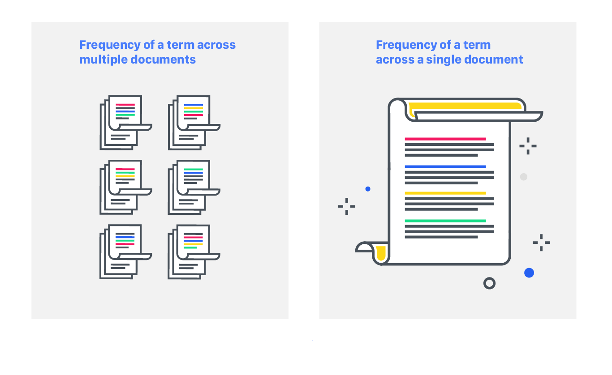

 

# Natural Language Processing

Natural Language Processing subject Repository - 5st Cohort, 2022 - Specialization degree in AI - FIUBA.

### Challenge 1: Word2vect
The objective was to vectorize a text, using OneHotEncoding, frequency vectors and TF-IDF.

The topics that we covered were: 
* One-hot Encoding codification
* Documents vectorization
* TF-IDF (Term Frequency – Inverse Document Frequency)
* Cosine similarity

[Notebook](https://github.com/emmanuelcardozo/Natural-Language-Processing/blob/main/Desafio%201/1a%20-%20word2vec.ipynb)

### Challenge 2: Simple bot
The objective was to create a rule-based bot using the Spacy library, NLTK and TF-IDF.

The topics that we covered were: 
* Document tokenization
* Lemmatization
* Special characters removal
* Stop words removal

[Notebook](https://github.com/emmanuelcardozo/Natural-Language-Processing/blob/main/Desafio%202/Desafio_2.ipynb)

### Challenge 3: Custom embeddings with Gensim
The objective was to create Custom Embeddings with Gensim.

The topics that we covered were: 
-Word Embeddings
-SkipGRAM & CBOW models 
-Embeddings generation with Gensim

[Notebook](https://github.com/emmanuelcardozo/Natural-Language-Processing/blob/main/Desafio%203/Desafio_3.ipynb)

### Challenge 4: Next Word Prediction
The objective was to predict the next word in a sequence of text using a NN with LSTM layers and Keras layer embedding. I used the book Ficciones from Borges as corpus to train the NN.

The topics that we covered were: 
* LSTM layers 
* Layer embeddings 
* RNN

[Notebook](https://github.com/emmanuelcardozo/Natural-Language-Processing/blob/main/Desafio%204/Desafio_4.ipynb)

### Challenge 5:  Sentiment analysis
The objective was to use the reviews of clothing buyers so that the system determines the evaluation of the buyer and his criticism (how many stars he assigns to the product).

The topics that we covered were: 
* Layer embeddings 
* LSTM

[Notebook](https://github.com/emmanuelcardozo/Natural-Language-Processing/blob/main/Desafio%205/5%20-%20clothing_ecommerce_reviews.ipynb)

### Challenge 6: Q&A Bot
The objective was to construct QA Bot using a QA dataset using LSTM, Glove embeddings or Fasttext embeddings.

The topics that we covered were: 
* Glove Embeddings
* Fasttext
* LSTM

[Notebook](https://github.com/emmanuelcardozo/Natural-Language-Processing/blob/main/Desafio%206/Desafio_6-bot_qa.ipynb)

Feel free to contact me by mail a.emmanuelcardozo@gmail.com for any doubt!

Thanks!
